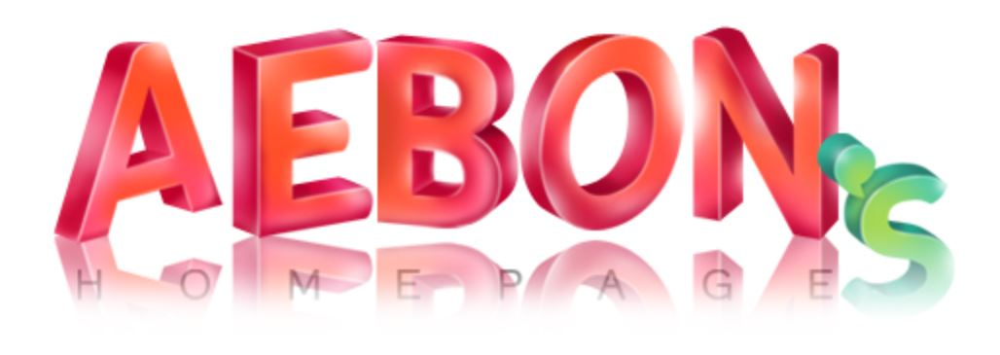

  

<h1 align="center">👩‍💻 Aebon Lee | AI & Education Specialist 🧩</h1>
<h3 align="center"><i>"기술과 교육을 연결하고, 실천으로 혁신을 만드는 교육 설계자"</i></h3>

  <!-- Animated typing SVG -->
  

  
  
  

---

## 💖 About Me

1988년 코딩을 처음 시작해서 지금까지 컴퓨터와 함께한 경력의 **실무형 교육자 / 개발자 / 기획자**로서  
직업훈련, 생성형 AI, Whisper 기반 챗봇, 데이터 분석, ISO 인증 시스템 등 다양한 프로젝트를 기획·운영해 왔습니다.

- 현) 한국직업능력개발센터 센터장  
- 현) 한신대학교 AI·SW 겸임교수
- 전) 경기대학교 겸임교수
- 고용노동부(2017, 2021)·산업통상자원부(2022) 장관상 총 3회 수상  
- 직업능력개발훈련교사 인공지능 직종 외 16개 분야 자격  
- 평생교육사 2급, 한국어교원 2급(3급 자격 이수)  
- 컴퓨터 관련 국가자격증 80여 종 보유 (정보처리, 웹디자인, 출판 외)  

---

## 📌 주요 프로젝트

### 🔹 HRDTMS 시스템 구축
- 교육기관 전용 LMS 및 비대면 교육지원 기능 개발
- 수강·출결·보고서·과제관리 통합 플랫폼 설계·운영

### 🔹 Whisper + GPT 기반 음성비서 챗봇
- Streamlit 기반 음성 인터페이스 구현
- TTS/STT 통합 + GPT 상담 파이프라인 구축

### 🔹 AHP 기반 직업훈련 역량 평가도구
- 정책연구 기반 AHP 프레임워크 설계
- 직업훈련 분야별 핵심역량 모델 개발 및 논문화

> 📎 [Notion 포트폴리오 바로가기](https://www.notion.so/aebon/)

---

## 🛠️ Tech Stack (Reorganized)

### 🎨 Frontend

<!-- Frameworks & UI -->

<!-- Languages -->

### ⚙️ Backend & APIs

<!-- Languages -->

<!-- Frameworks & Runtimes -->

### 🧠 Data / AI

### 🗄 Databases

### ☁️ DevOps / Infra / Tools

### 🎨 Design & Creative

---

## 🏆 GitHub Trophy (Animated)

  

---

## 📊 GitHub Stats & Streak

  
  

---

## 📈 Top Languages

  

## 📊 Dev Snapshot

  
  
  

---

## 📊 Activity Graph (Animated)

  

---

## 🐍 Contribution Snake

---

## 🔗 Links
- 🌐 [Notion 포트폴리오](https://www.notion.so/aebon/)
- 📄 [Notion 이력서](https://www.notion.so/aebon/Aebon-s-Information-Career-7b97e044c1d7432ab8333af05e0ac968)
- 💼 [LinkedIn](https://www.linkedin.com/in/aebon/)
- 🎥 [YouTube (예정)](https://www.youtube.com/@%EC%9D%B4%EC%95%A0%EB%B3%B8%EA%B5%90%EC%88%98%EC%9D%98%EC%97%AD%EB%9F%89%EA%B8%B0%EB%B0%98)

---

## 📬 Contact
📧 **Email**: aebon@kyonggi.ac.kr  

> 더 나은 기술 교육을 고민하는 모든 분과 협업하고 싶습니다.  
> **Feel free to connect!**

---

  

© 2024 **Aebon Lee** | Powered by Whisper, GPT, and lifelong curiosity.
